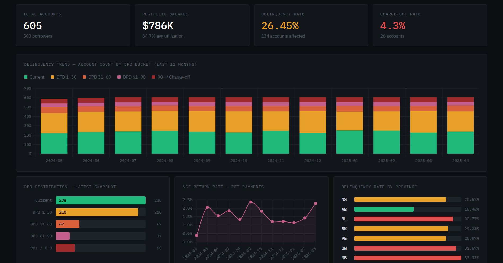

# Credit Risk DBT (Data Build Tool)

A dbt project simulating a credit risk reporting pipeline. Models cover the full stack from raw account and payment data through to regulatory-grade monthly snapshots and portfolio roll-up aggregates.

Stack: dbt Core, DuckDB (local), Redshift (prod target), Python for seed generation.

## Dashboard



## Setup

```bash
pip install dbt-duckdb
python scripts/generate_seed_data.py
dbt deps
dbt seed
dbt run
dbt test
dbt snapshot
```

The seed script generates synthetic data (500 borrowers, ~605 accounts, ~15k monthly balance records, ~6k payments). `dbt seed` loads those CSVs into DuckDB. `dbt run` builds all models in dependency order.

## Running a specific model

```bash
dbt run --select mart_credit_reporting_monthly
dbt run --select staging.*
```

First-time incremental run:

```bash
dbt run --select mart_credit_reporting_monthly --full-refresh
```

Overriding risk thresholds at runtime:

```bash
dbt run --vars '{"charge_off_threshold": 180, "dpd_90_threshold": 95}'
```

## Models

**Staging** (`models/staging/`) - views that cast types and add simple derived columns. One model per source table.

**Intermediate** (`models/intermediate/`) - ephemeral model that joins balances, payments, and accounts into a single feature set. Computes roll direction, trailing NSF counts, and utilization deltas. Not materialized as a table.

**Marts** (`models/marts/`) - two output tables:
- `mart_credit_reporting_monthly`: one row per account per month, incremental merge. Feeds regulatory reporting and bureau submissions.
- `mart_portfolio_risk_summary`: aggregated by month, product, and DPD bucket. Used for internal risk monitoring.

**Snapshots** (`snapshots/`) - SCD Type-2 on borrower credit score band, so historical band changes are preserved for look-back.

## Tests

Schema tests (unique, not_null, relationships, accepted ranges) are in `models/schema.yml`. Two custom singular tests are in `tests/`:
- `assert_no_negative_payment_shortfall.sql`
- `assert_chargeoff_exposure_consistency.sql`

Run with `dbt test`.

## Dashboard data

```bash
python scripts/build_dashboard_data.py
python -m http.server
```

Runs the pipeline in-memory via DuckDB and writes `dashboard/data.json` with portfolio KPIs, delinquency trend, NSF rate, and province breakdown, and views the dashboard file in `localhost:8000`.
